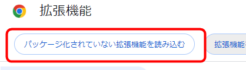
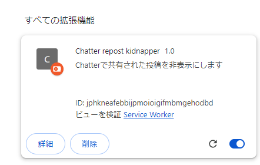
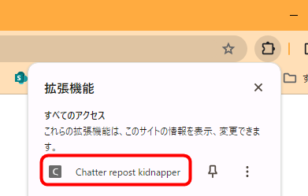
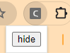

# Chatterを見やすくするChrome拡張

## 機能

1. ChatterのRepostを~~非表示~~1行表示にします。
2. 投稿の既読を管理し、既読投稿の表示⇔非表示を切り替えられます。
3. PCでもなぜかスマホ用レイアウトなのをPC幅表示にします

以下のURLにマッチするページで動作します。変更が必要な場合は`manifest.json`を編集してください。

```
https://*.salesforce.com/*/chatter/*
```

## 導入方法

1. Chromeで`chrome://extensions/`を開きます
2. 画面右上のデベロッパーモードを有効にします

    

1. `パッケージ化されていない拡張機能を読み込む`をクリックします

    

2. ChatterRepostKidnapperフォルダを選択します
3. 下図のようになれば導入完了です。

    

## 使い方

拡張機能アイコンから`Chatter repost kidnapper`にアクセスしてください。



`hide`ボタンを押すと既読アイテムを非表示にします。



既に非表示の状態の場合は再表示のために`show`ボタンに切り替わります。


### 既読非表示機能

「既読にする」をクリックするとその投稿を既読にしてhideモード状態で非表示にできます。  
既読状態にしたものはshowモードにするか、「未読にする」をクリックすることで常時表示に戻すことができます。
